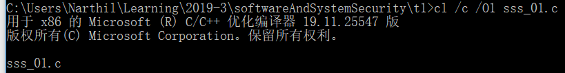
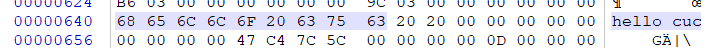
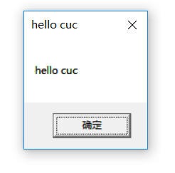
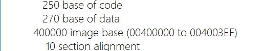
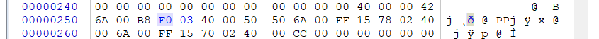
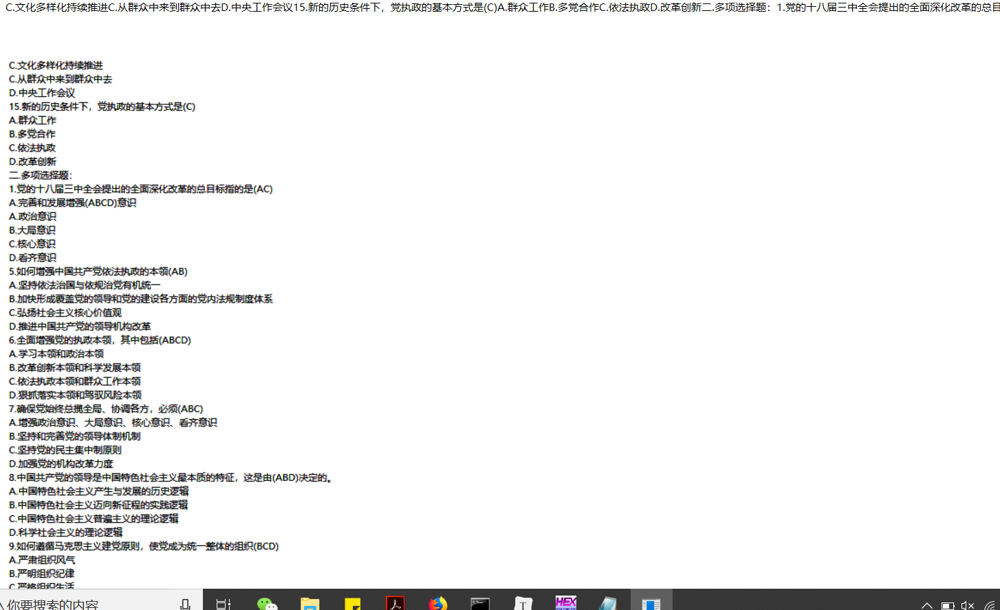

# 2019-3-9

## 第1题

### 题目要求

- 编写一个release版本的 hello world 程序。通过修改程序可执行文件的方式（不是修改源代码），使得程序运行后显示的内容不为hello world，变成 hello cuc！

### 实验步骤

- 编写程序

- ```c
  # include <Windows.h>
  int main()
  {
  	MessageBoxA(NULL, "hello world", "hello world", MB_OK);
  	ExitProcess(0);
  }
  ```

- 编译链接
  - 
  - 
  - 用二进制编辑器winHex打开生成的`.exe`文件
  - `ctrl+F`找到字符串`hello world`所在的位置
  - 右键`world`对应的十六进制码，选择`edit -> fill block`进行修改，修改为`cuc`对应的十六进制码
  - 

- 运行程序

  - 


## 第2题

### 题目要求

- 上一题的程序中，修改的显示内容变为一个很长的字符串（至少2kb长）。并且保证程序正常运行不崩溃。

### 实验步骤

- 生成反汇编文件找到基地址：`dumpbin /headers /nologo sss_01.exe > dump_1.txt`
  - 
  - 基地址为00400000h
- 用`winHex`打开上一题生成的exe文件`sss_01.exe`
- 找到hello cuc的地址偏移为280h
  - 
  - 上数三行，可以找到指向存储该字符串的指针
- 在文件末尾添加一段长2kb的文字（我从之前毛概的题里截出来的
- 将250行的指针修改为末尾的地址`03F0`
  - 
- 保存并运行
- 运行结果
  - 

