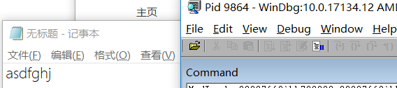
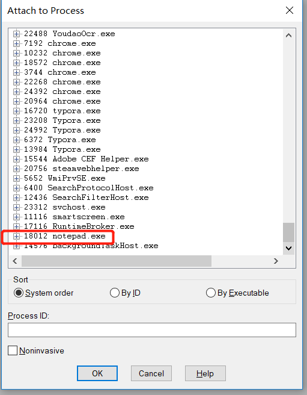
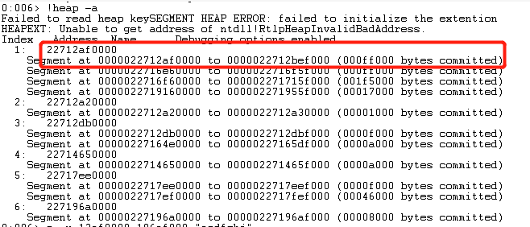
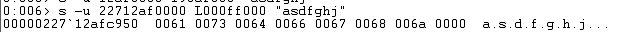
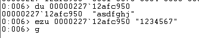
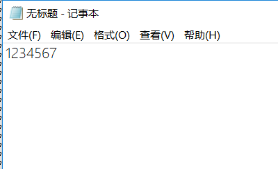

# 2019-3-10

## 题目要求

- 在notepad（32位64位均可）中，输入一段文字。然后使用调试器，在内存中修改这段文字。使得没有在界面操作notepad的修改文字的情况下。notepad中显示的文字变化。

  提示，在调试器中定位控件缓存的内存地址，可以用搜索、逆向、消息截获分析、API截获分析等方法。

  软件是数据和对数据的操作的集合。 软件安全就是研究软件的操作的具体过程、数据的具体形式，然后想办法获得、修改、破坏或者实施隐藏。又分为攻和防两个方面。 底层的软件，一次操作所能影响的数据少，操作的逻辑简单。 越到高层，一次操作所能影响的数据越多，操作的逻辑越复杂。 例如 指令 -> C语言语句 -> 函数 -> 对象 汇编 -> C -> C++ -> 各类脚本。 所以，我们进行软件攻防也有两种基本的方法。 hook 和 DKOM hook，挂钩，即找到程序中的原有代码，并修改其代码，增加、减少或者篡改原用功能。达到授权破解（keygen）、作弊（游戏外挂）、隐藏（隐蔽攻击痕迹防止被防御软件查杀）等目的。 DKOM，直接内核对象操作。是一种典型的直接对程序内部数据的攻击。

## 实验步骤

- 打开notepad，写入`asdfghj`

  - 

- 打开winDbg，点击`file->attach to process`，在界面中找到`notepad.exe`，列出所有已分配的堆

  - 

- 在命令行中输入指令找到notepad中输入的字符串

  - 查看所有堆：`!heap -a`
  - 
  - 查找字符串：`s -u 22712af0000 L000ff000 "asdfghj"`
  - 
  - 显示unicode：du 00000227`12afc950
  - 修改字符串：ezu 00000227`12afc950 "1234567"
  - 继续运行：`g`
  - 
  - 运行结果
  - 

  

